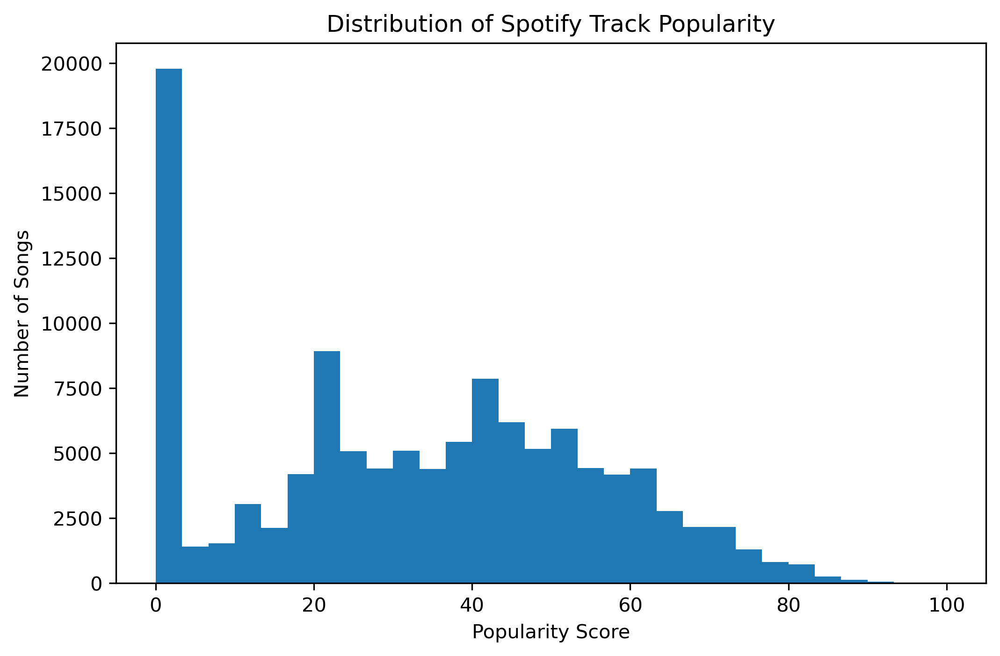
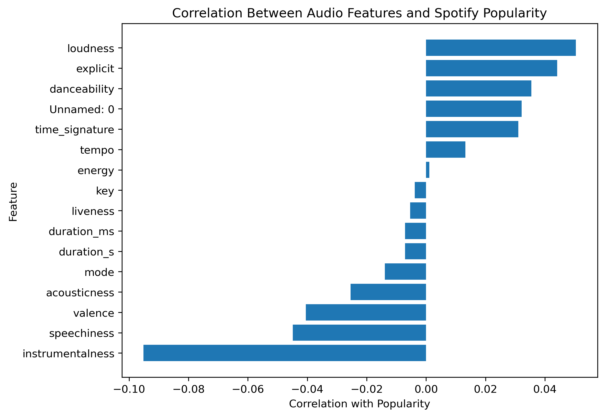
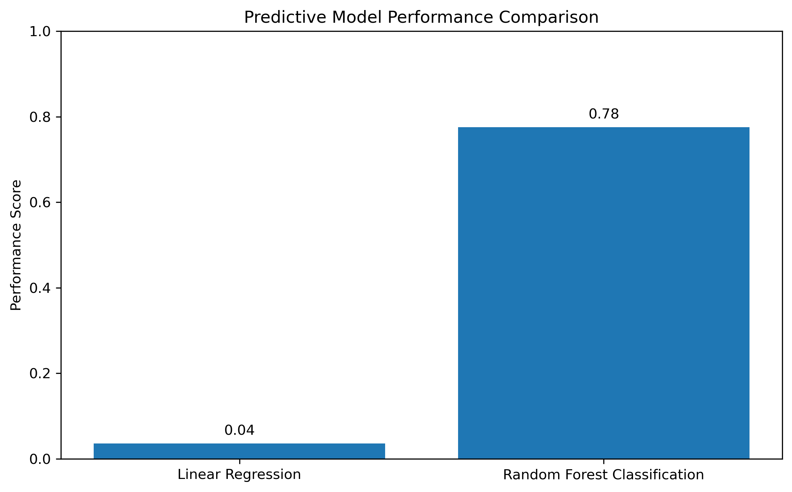
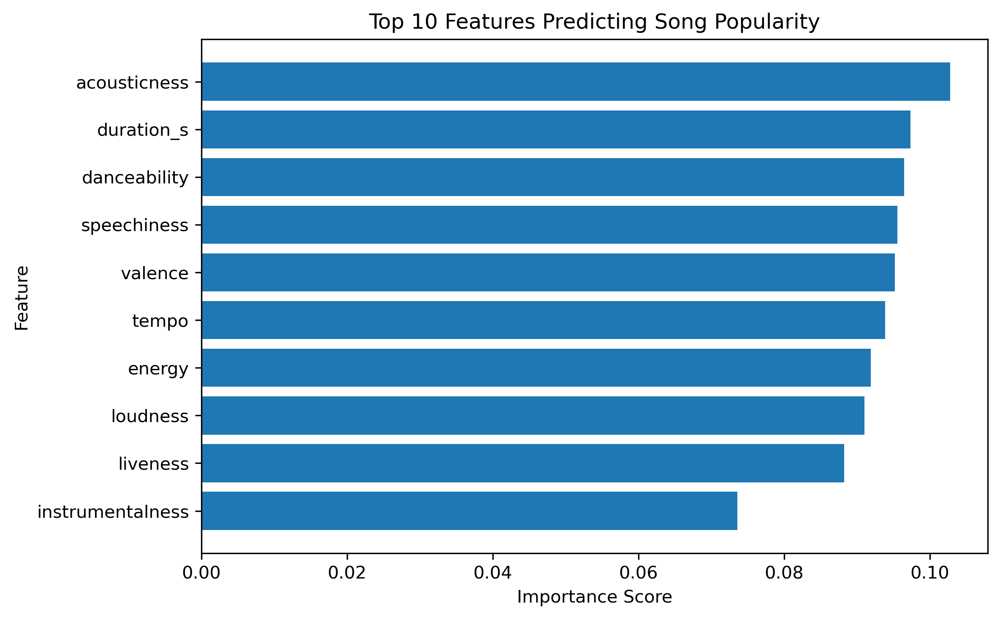
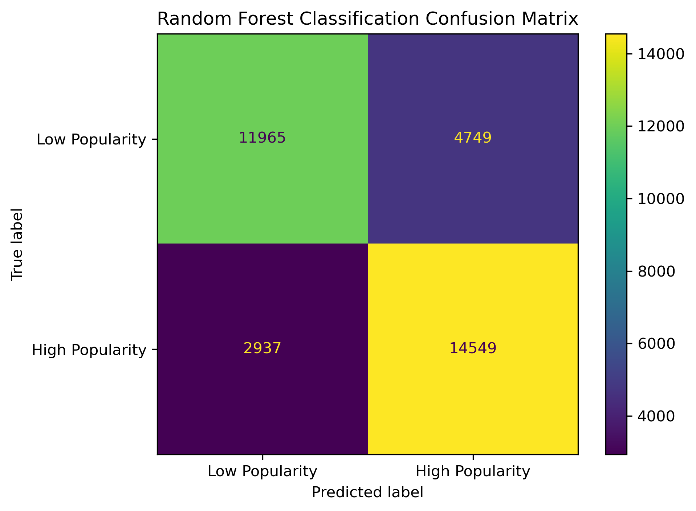

# Predictive Analytics of Music Popularity

## Overview
This project analyzes over 100,000 Spotify tracks to identify audio characteristics associated with song popularity. Using Python and machine learning techniques, I explored relationships between audio features and popularity and built predictive models to classify and estimate popularity.

## Objective
Investigate whether audio features such as danceability, energy, tempo, valence, and acousticness can predict Spotify track popularity.

---

## Dataset Description

This project uses a public Spotify dataset containing over 100,000 tracks. The dataset includes track metadata, genre information, Spotify popularity scores, and audio features.

The target variable is:

- **Popularity**: Spotify's track popularity score ranging from 0 to 100, where higher values indicate more popular tracks.

Key audio features used for prediction include:

| Feature | Description |
|---|---|
| Danceability | How suitable a track is for dancing based on rhythm and tempo |
| Energy | Measure of intensity and activity of a track |
| Valence | Measure of musical positivity (higher values indicate happier sounds) |
| Tempo | Track speed measured in beats per minute (BPM) |
| Acousticness | Likelihood that a track is acoustic |
| Instrumentalness | Likelihood that a track contains no vocals |
| Speechiness | Presence of spoken words in a track |
| Loudness | Overall loudness measured in decibels |
| Liveness | Likelihood that a track was performed live |

---

## Exploratory Data Analysis

### Spotify Popularity Distribution

To understand the distribution of track popularity scores, I analyzed the frequency of songs across different popularity levels. This helped determine the structure of the target variable and informed the creation of popularity categories for classification.

### Audio Feature Correlation with Popularity

To understand relationships between audio characteristics and popularity, I calculated correlations between numerical audio features and Spotify popularity scores.

The analysis shows which audio features have stronger positive or negative relationships with track popularity.

---

## Predictive Modeling

Two machine learning approaches were used:

### 1. Linear Regression Model
- Predicted continuous Spotify popularity scores using audio features.
- Evaluated performance using R².

### 2. Random Forest Classification Model
- Converted popularity scores into binary categories (high vs. low popularity).
- Predicted popularity groups using audio features.
- Evaluated performance using accuracy, precision, recall, and confusion matrices.

---

## Predictive Model Performance Comparison

Linear Regression was evaluated using R², while Random Forest Classification was evaluated using accuracy. The Random Forest model achieved stronger predictive performance, reaching **77% accuracy** when predicting popularity categories.

---

## Random Forest Feature Importance

The Random Forest model was used to identify which audio characteristics contributed most to popularity predictions.

---

## Classification Evaluation

The confusion matrix below shows the model's ability to correctly classify high and low popularity tracks.

---

## Tools Used
- Python
- Pandas
- Scikit-learn
- Matplotlib
- Seaborn

## Skills Demonstrated
- Data cleaning and preprocessing
- Exploratory data analysis
- Machine learning
- Model evaluation
- Data visualization
